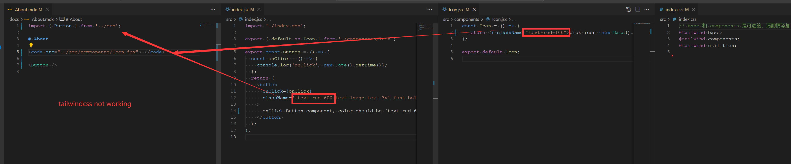
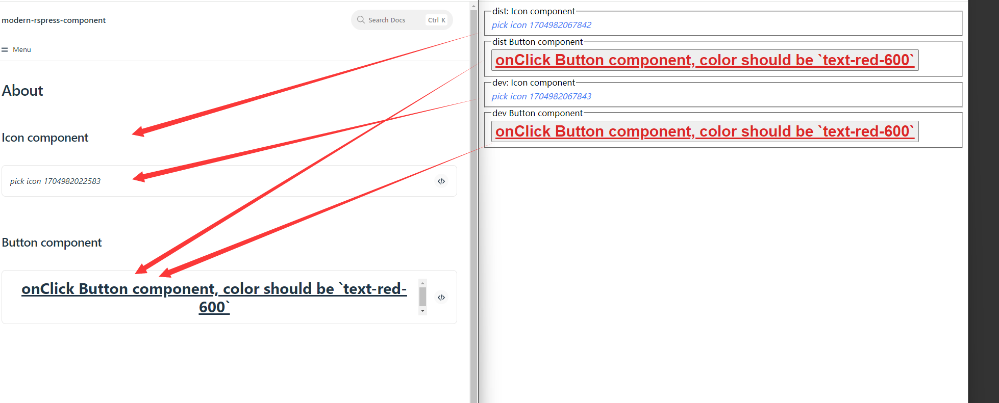

# Modern.js Package

## Setup

- 1. open rspress

```bash
pnpm run install
pnpm run dev
# visit http://localhost:8080/
```



- 2. import dist packages by vite

```bash
pnpm run build
pnpm run dev-vite

# visit http://localhost:5173/
```

left side: on the rspress demo page

right side: on the vite pate


